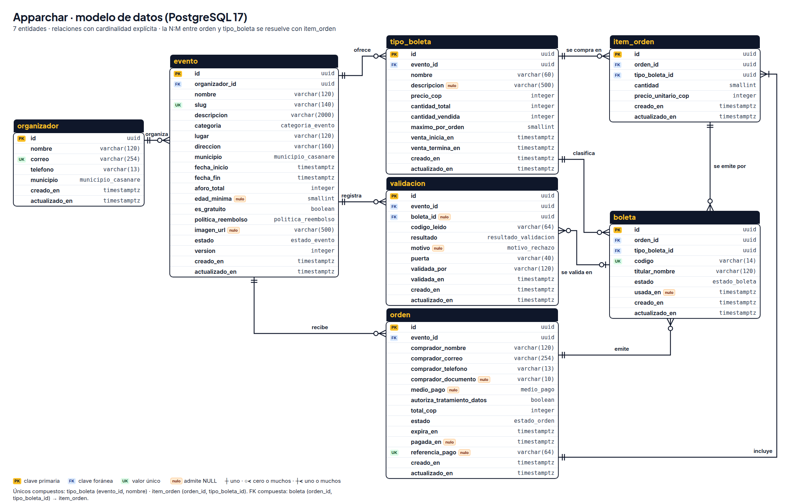
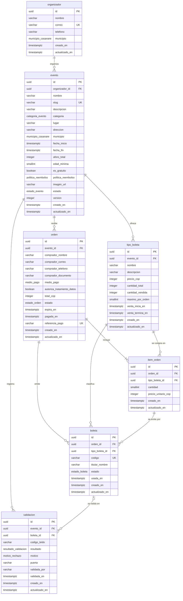

# Modelo de datos de Apparchar

Versión 0.2.0 · Entrega 2 · Motor: **PostgreSQL 17**

Este documento es la fuente de verdad de los datos. El contrato de la API
([`api/openapi.yaml`](../api/openapi.yaml)), los datos de ejemplo del prototipo
([`web/datos/ejemplo.json`](../web/datos/ejemplo.json)) y los formularios de
[`web/`](../web/) usan exactamente los mismos nombres de atributo. El script
`npm run verificar` compara los cuatro y falla si alguno se desvía (ver §10).

## 1. Motor elegido: PostgreSQL

Vender boletas es una operación de inventario: dos personas no pueden comprar el
último cupo. PostgreSQL garantiza eso en la propia base de datos con
transacciones ACID y restricciones `CHECK` (`cantidad_vendida <= cantidad_total`),
`UNIQUE` (un código de boleta no se repite y una boleta solo tiene un ingreso
aceptado) y claves foráneas (no hay boletas sin orden ni órdenes sin evento).
Además, el dominio es relacional (evento → tipos de boleta → órdenes → boletas →
validaciones) y los reportes de ventas por evento son agregaciones SQL
directas. MongoDB obligaría a reimplementar esas garantías en el código.

**La primera versión es NoSQL.** Apparchar ya funciona en
[apparchar.sbs](https://apparchar.sbs) sobre Firebase Realtime Database, una base
NoSQL que guarda todo como un solo árbol JSON. Este modelo no parte de cero:
traduce ese árbol a tablas, nodo por nodo (§12). Se cambia de motor por la misma
razón del párrafo anterior. En el árbol, las reglas de seguridad pueden validar
un campo, pero no hay claves foráneas ni índices únicos, y una transacción
condicional cubre un solo nodo. Así, el cupo, el ingreso único y la coherencia
entre las copias de un mismo dato dependen del código (decisión D-22).

## 2. Convenciones

| Convención | Regla |
|---|---|
| Idioma y forma | Español, singular, `snake_case`: tabla `tipo_boleta`, atributo `fecha_inicio`. El mismo nombre en la base, en el contrato y en los datos de ejemplo. |
| Identificadores | `uuid` generado por la base (`gen_random_uuid()`). No son consecutivos: no se puede adivinar la orden de otra persona. |
| Fechas | `timestamptz`. Se guardan en UTC y se muestran en hora de Colombia (`America/Bogota`, UTC−5, sin horario de verano). En la API viajan en ISO 8601 con desfase: `2026-10-03T21:00:00-05:00`. |
| Dinero | Pesos colombianos enteros, sufijo `_cop` (`precio_cop`, `total_cop`). El peso no usa centavos en la práctica, así que no hay redondeos. |
| Campos de control | `creado_en` y `actualizado_en` en todas las entidades; un disparador actualiza `actualizado_en` en cada `UPDATE`. `evento` lleva además `version` para el bloqueo optimista (ver §8). |
| Columna «Lo llena» | `usuario` si lo escribe una persona en un formulario (organizador, comprador o portero); `cliente` si lo manda la aplicación sin que la persona lo escriba (el evento de la página); `sistema` si lo calcula el backend. |
| Término `slug` | Se conserva el término técnico estándar para la parte legible de una URL (`noche-de-rock-…-7d40`); no tiene un equivalente corto en español y así lo usan las herramientas y la documentación web. |

## 3. Diagrama



El mismo diagrama en Mermaid (GitHub lo dibuja al abrir este archivo):



## 4. Dominios (enumeraciones)

En PostgreSQL son tipos `ENUM`; en el contrato, `enum` de JSON Schema con los
mismos valores.

| Dominio | Valores | Se usa en |
|---|---|---|
| `categoria_evento` | `concierto`, `fiesta`, `conferencia`, `deportes`, `teatro`, `festival`, `otro` | `evento.categoria` |
| `municipio_casanare` | `Aguazul`, `Chámeza`, `Hato Corozal`, `La Salina`, `Maní`, `Monterrey`, `Nunchía`, `Orocué`, `Paz de Ariporo`, `Pore`, `Recetor`, `Sabanalarga`, `Sácama`, `San Luis de Palenque`, `Támara`, `Tauramena`, `Trinidad`, `Villanueva`, `Yopal` | `organizador.municipio`, `evento.municipio` |
| `estado_evento` | `borrador`, `publicado`, `pausado`, `agotado`, `cancelado`, `finalizado` | `evento.estado` |
| `politica_reembolso` | `ninguno`, `hasta_24h_antes`, `hasta_72h_antes` | `evento.politica_reembolso` |
| `medio_pago` | `pse`, `nequi`, `daviplata`, `tarjeta` | `orden.medio_pago` |
| `estado_orden` | `pendiente`, `pagada`, `expirada`, `reembolsada` | `orden.estado` |
| `estado_boleta` | `valida`, `usada`, `cancelada` | `boleta.estado` |
| `resultado_validacion` | `aceptada`, `rechazada` | `validacion.resultado` |
| `motivo_rechazo` | `ya_usada`, `cancelada`, `otro_evento`, `no_existe` | `validacion.motivo` |

## 5. Entidades

### Entidad `organizador`

Persona, colectivo o empresa que crea eventos: un bar de Yopal, una fundación
cultural de Tauramena, el consejo estudiantil de una universidad.

| Atributo | Tipo | Nulo | Por defecto | Restricciones | Lo llena | Descripción |
|---|---|---|---|---|---|---|
| `id` | `uuid` | No | `gen_random_uuid()` | PK | sistema | Identificador. |
| `nombre` | `varchar(120)` | No | — | 3 a 120 caracteres | usuario | Nombre público: «Colectivo Sabana Rock». |
| `correo` | `varchar(254)` | No | — | Único; 6 a 254 caracteres; en minúsculas; formato de correo | usuario | Correo de contacto y de acceso. |
| `telefono` | `varchar(13)` | No | — | Formato E.164 de Colombia: `+573XXXXXXXXX` (celular) o `+5760XXXXXXXX` (fijo) | usuario | Teléfono de contacto. |
| `municipio` | `municipio_casanare` | No | — | Dominio `municipio_casanare` | usuario | Municipio base: «Yopal». |
| `creado_en` | `timestamptz` | No | `now()` | — | sistema | Fecha de registro. |
| `actualizado_en` | `timestamptz` | No | `now()` | Disparador en cada `UPDATE` | sistema | Última modificación. |

### Entidad `evento`

Un evento con fecha, lugar y aforo. El aforo es la capacidad autorizada del
lugar; la suma de los cupos de sus tipos de boleta no puede superarlo.

| Atributo | Tipo | Nulo | Por defecto | Restricciones | Lo llena | Descripción |
|---|---|---|---|---|---|---|
| `id` | `uuid` | No | `gen_random_uuid()` | PK | sistema | Identificador. |
| `organizador_id` | `uuid` | No | — | FK → `organizador.id` | sistema | Dueño del evento (sale del token). |
| `nombre` | `varchar(120)` | No | — | 3 a 120 caracteres | usuario | «Noche de rock llanero: Sabana Eléctrica en vivo». |
| `slug` | `varchar(140)` | No | — | Único; 3 a 140 caracteres; `^[a-z0-9]+(-[a-z0-9]+)*$`; inmutable (lo impide el disparador) | sistema | Parte legible de la URL pública: `<nombre>-<año>-<4 caracteres>`. |
| `descripcion` | `varchar(2000)` | No | — | 20 a 2.000 caracteres; texto plano | usuario | Qué va a pasar, horarios de puertas, qué llevar. |
| `categoria` | `categoria_evento` | No | — | Dominio `categoria_evento` | usuario | Filtra la cartelera. |
| `lugar` | `varchar(120)` | No | — | 2 a 120 caracteres | usuario | «Bar La Tranquera». |
| `direccion` | `varchar(160)` | No | — | 5 a 160 caracteres | usuario | «Carrera 23 # 12-40, barrio El Centro». |
| `municipio` | `municipio_casanare` | No | — | Dominio `municipio_casanare` | usuario | «Yopal». Filtra la cartelera. |
| `fecha_inicio` | `timestamptz` | No | — | Futura al publicar | usuario | Hora de inicio. |
| `fecha_fin` | `timestamptz` | No | — | `fecha_fin > fecha_inicio` | usuario | Hora de cierre (puede ser la madrugada siguiente). |
| `aforo_total` | `integer` | No | — | 1 a 100.000 | usuario | Capacidad autorizada del lugar. |
| `edad_minima` | `smallint` | Sí | `NULL` | 1 a 21; `NULL` = todo público | usuario | 18 en bares y discotecas. |
| `es_gratuito` | `boolean` | No | `false` | Si es `true`, todos los tipos valen 0 | usuario | Evento de entrada libre con boleta para controlar el aforo. |
| `politica_reembolso` | `politica_reembolso` | No | `'hasta_24h_antes'` | Dominio `politica_reembolso` | usuario | Hasta cuándo se devuelve el dinero. |
| `imagen_url` | `varchar(500)` | Sí | `NULL` | Empieza por `https://` | usuario | Póster o portada. |
| `estado` | `estado_evento` | No | `'borrador'` | Transiciones de §9 | sistema | Cambia con acciones del organizador o del sistema. |
| `version` | `integer` | No | `1` | ≥ 1; sube en cada `UPDATE` | sistema | Bloqueo optimista: la edición envía la versión que leyó. |
| `creado_en` | `timestamptz` | No | `now()` | — | sistema | Fecha de creación. |
| `actualizado_en` | `timestamptz` | No | `now()` | Disparador en cada `UPDATE` | sistema | Última modificación. |

### Entidad `tipo_boleta`

Una localidad o clase de entrada del evento («Preventa», «General», «VIP»): fija
el precio, el cupo y la ventana de venta.

| Atributo | Tipo | Nulo | Por defecto | Restricciones | Lo llena | Descripción |
|---|---|---|---|---|---|---|
| `id` | `uuid` | No | `gen_random_uuid()` | PK | sistema | Identificador. |
| `evento_id` | `uuid` | No | — | FK → `evento.id`; único junto con `nombre` | sistema | Evento al que pertenece. |
| `nombre` | `varchar(60)` | No | — | 2 a 60 caracteres; no se repite en el evento | usuario | «General». |
| `descripcion` | `varchar(500)` | Sí | `NULL` | Hasta 500 caracteres | usuario | Qué incluye. |
| `precio_cop` | `integer` | No | — | 0 a 10.000.000; 0 si el evento es gratuito | usuario | Precio por boleta en pesos. |
| `cantidad_total` | `integer` | No | — | 1 a 100.000; ≥ `cantidad_vendida` | usuario | Cupo del tipo. |
| `cantidad_vendida` | `integer` | No | `0` | 0 ≤ `cantidad_vendida` ≤ `cantidad_total` | sistema | Unidades comprometidas en órdenes pendientes o pagadas. |
| `maximo_por_orden` | `smallint` | No | `10` | 1 a 20 | usuario | Tope por compra; frena la reventa. |
| `venta_inicia_en` | `timestamptz` | No | `now()` | — | usuario | Desde cuándo se vende; si no se envía, desde el momento de creación. |
| `venta_termina_en` | `timestamptz` | No | — (si no se envía, la API usa `evento.fecha_inicio`) | `> venta_inicia_en` y `<= evento.fecha_fin` | usuario | Hasta cuándo se vende. |
| `creado_en` | `timestamptz` | No | `now()` | — | sistema | Fecha de creación. |
| `actualizado_en` | `timestamptz` | No | `now()` | Disparador en cada `UPDATE` | sistema | Última modificación. |

### Entidad `orden`

Una compra. Se crea en estado `pendiente`, reserva el cupo durante 15 minutos y
pasa a `pagada` cuando se confirma el pago. Se compra sin crear cuenta.

| Atributo | Tipo | Nulo | Por defecto | Restricciones | Lo llena | Descripción |
|---|---|---|---|---|---|---|
| `id` | `uuid` | No | `gen_random_uuid()` | PK | sistema | Identificador; también es el enlace privado de la compra. |
| `evento_id` | `uuid` | No | — | FK → `evento.id` | cliente | Evento comprado (lo toma la página del evento). |
| `comprador_nombre` | `varchar(120)` | No | — | 3 a 120 caracteres | usuario | Nombre y apellido; va impreso en las boletas. |
| `comprador_correo` | `varchar(254)` | No | — | 6 a 254 caracteres; formato de correo; en minúsculas | usuario | Adonde llegan las boletas. |
| `comprador_telefono` | `varchar(13)` | No | — | Celular colombiano E.164: `+573XXXXXXXXX` | usuario | Para avisos de cambios del evento. |
| `comprador_documento` | `varchar(10)` | Sí | `NULL` | 6 a 10 dígitos (cédula); obligatorio si el evento tiene `edad_minima` | usuario | Se verifica en la puerta en eventos para mayores de edad. |
| `medio_pago` | `medio_pago` | Sí | `NULL` | Obligatorio si `total_cop > 0`; `NULL` si la orden es gratuita | usuario | PSE, Nequi, Daviplata o tarjeta. |
| `autoriza_tratamiento_datos` | `boolean` | No | — | Debe ser `true` (Ley 1581 de 2012) | usuario | Autorización expresa de tratamiento de datos personales. |
| `total_cop` | `integer` | No | — | ≥ 0; lo calcula el servidor con los precios vigentes | sistema | Total que paga el comprador. |
| `estado` | `estado_orden` | No | `'pendiente'` | Transiciones de §9 | sistema | Estado de la compra. |
| `expira_en` | `timestamptz` | No | `now() + interval '15 minutes'` | Posterior a `creado_en` | sistema | Hasta cuándo se reserva el cupo. |
| `pagada_en` | `timestamptz` | Sí | `NULL` | No nulo solo si `estado` es `pagada` o `reembolsada` | sistema | Momento de la confirmación del pago. |
| `referencia_pago` | `varchar(64)` | Sí | `NULL` | Única cuando no es nula; 1 a 64 caracteres; obligatoria si la orden se pagó con `total_cop > 0` | sistema | Identificador de la transacción en la pasarela: permite conciliar pagos y rechazar una confirmación repetida. |
| `creado_en` | `timestamptz` | No | `now()` | — | sistema | Fecha de creación. |
| `actualizado_en` | `timestamptz` | No | `now()` | Disparador en cada `UPDATE` | sistema | Última modificación. |

### Entidad `item_orden`

Línea de una orden: cuántas boletas de un tipo se compraron y a qué precio.
Resuelve la relación muchos a muchos entre `orden` y `tipo_boleta` y congela el
precio del momento de la compra.

| Atributo | Tipo | Nulo | Por defecto | Restricciones | Lo llena | Descripción |
|---|---|---|---|---|---|---|
| `id` | `uuid` | No | `gen_random_uuid()` | PK | sistema | Identificador. |
| `orden_id` | `uuid` | No | — | FK → `orden.id`; único junto con `tipo_boleta_id` | sistema | Orden a la que pertenece. |
| `tipo_boleta_id` | `uuid` | No | — | FK → `tipo_boleta.id`; del mismo evento de la orden | usuario | Tipo elegido en la página del evento. |
| `cantidad` | `smallint` | No | — | 1 a 20; ≤ `tipo_boleta.maximo_por_orden` | usuario | Boletas de este tipo. |
| `precio_unitario_cop` | `integer` | No | — | ≥ 0; copia de `tipo_boleta.precio_cop` al comprar | sistema | Precio congelado. |
| `creado_en` | `timestamptz` | No | `now()` | — | sistema | Fecha de creación. |
| `actualizado_en` | `timestamptz` | No | `now()` | Disparador en cada `UPDATE` | sistema | Última modificación. |

### Entidad `boleta`

Una entrada individual con código QR. Se emite una por unidad cuando la orden
queda pagada.

| Atributo | Tipo | Nulo | Por defecto | Restricciones | Lo llena | Descripción |
|---|---|---|---|---|---|---|
| `id` | `uuid` | No | `gen_random_uuid()` | PK | sistema | Identificador. |
| `orden_id` | `uuid` | No | — | FK → `orden.id`; junto con `tipo_boleta_id`, FK → `item_orden` | sistema | Orden que la emitió. |
| `tipo_boleta_id` | `uuid` | No | — | FK → `tipo_boleta.id`; el par (`orden_id`, `tipo_boleta_id`) existe en `item_orden` | sistema | Tipo de la boleta, que la orden sí compró. |
| `codigo` | `varchar(14)` | No | — | Único; `^[A-HJKMNP-Z2-9]{4}-[A-HJKMNP-Z2-9]{4}-[A-HJKMNP-Z2-9]{4}$` | sistema | Lo que codifica el QR y lo que se digita si la cámara falla. 12 caracteres aleatorios sin letras ambiguas (sin I, L, O, 0 ni 1): unos 59 bits, imposible de adivinar. |
| `titular_nombre` | `varchar(120)` | No | — | 3 a 120 caracteres | sistema | Nombre que ve el portero (copia de `orden.comprador_nombre`). |
| `estado` | `estado_boleta` | No | `'valida'` | Transiciones de §9 | sistema | Si sirve para entrar. |
| `usada_en` | `timestamptz` | Sí | `NULL` | No nulo solo si `estado = 'usada'` | sistema | Momento del ingreso. |
| `creado_en` | `timestamptz` | No | `now()` | — | sistema | Fecha de emisión. |
| `actualizado_en` | `timestamptz` | No | `now()` | Disparador en cada `UPDATE` | sistema | Última modificación. |

### Entidad `validacion`

Cada lectura de un código en la puerta, aceptada o rechazada. Es el registro de
auditoría del ingreso y alimenta el conteo en vivo del aforo.

| Atributo | Tipo | Nulo | Por defecto | Restricciones | Lo llena | Descripción |
|---|---|---|---|---|---|---|
| `id` | `uuid` | No | `gen_random_uuid()` | PK | sistema | Identificador. |
| `evento_id` | `uuid` | No | — | FK → `evento.id` | usuario | Evento en cuya puerta se leyó el código; el portero lo elige al empezar. |
| `boleta_id` | `uuid` | Sí | `NULL` | FK → `boleta.id`; `NULL` si el código no existe | sistema | Boleta encontrada. |
| `codigo_leido` | `varchar(64)` | No | — | 1 a 64 caracteres, tal como llegó | usuario | Lo que leyó la cámara o digitó el portero. |
| `resultado` | `resultado_validacion` | No | — | Dominio `resultado_validacion` | sistema | Si la persona entra o no. |
| `motivo` | `motivo_rechazo` | Sí | `NULL` | `NULL` si fue aceptada; obligatorio si fue rechazada | sistema | Por qué se rechazó. |
| `puerta` | `varchar(40)` | No | `'Principal'` | 2 a 40 caracteres | usuario | Acceso donde se validó. |
| `validada_por` | `varchar(120)` | No | — | 2 a 120 caracteres | usuario | Nombre de quien hizo la lectura (el celular de la puerta usa la sesión del organizador). |
| `validada_en` | `timestamptz` | No | `now()` | La pone el servidor al recibir la lectura | sistema | Momento de la lectura según el reloj del servidor. Existe aparte de `creado_en` para cuando se sincronicen lecturas hechas sin conexión (fuera de alcance en esta versión). |
| `creado_en` | `timestamptz` | No | `now()` | — | sistema | Momento en que llegó al servidor. |
| `actualizado_en` | `timestamptz` | No | `now()` | Disparador en cada `UPDATE` | sistema | Última modificación. |

## 6. Relaciones y cardinalidad

| Relación | Cardinalidad | Clave foránea | Al borrar el padre | Explicación |
|---|---|---|---|---|
| `organizador` → `evento` | Uno a muchos (1:N) | `evento.organizador_id` | `RESTRICT` | Un organizador crea muchos eventos; cada evento tiene un solo dueño. |
| `evento` → `tipo_boleta` | Uno a muchos (0..N; al menos uno para publicar) | `tipo_boleta.evento_id` | `CASCADE` | Un borrador puede no tener tipos todavía. Solo se borran eventos en borrador, que no tienen ventas. |
| `evento` → `orden` | Uno a muchos (1:N) | `orden.evento_id` | `RESTRICT` | Una orden compra boletas de un solo evento. |
| `orden` ↔ `tipo_boleta` | Muchos a muchos (N:M) mediante `item_orden` | `item_orden.orden_id`, `item_orden.tipo_boleta_id` | `CASCADE` / `RESTRICT` | Una orden lleva varios tipos (2 General + 1 VIP) y un tipo se vende en muchas órdenes. |
| `orden` → `boleta` | Uno a muchos (1:N) | `boleta.orden_id` | `RESTRICT` | Una boleta por unidad comprada. |
| `tipo_boleta` → `boleta` | Uno a muchos (1:N) | `boleta.tipo_boleta_id` | `RESTRICT` | Cada boleta es de un tipo. |
| `item_orden` → `boleta` | Uno a muchos (1:N) | `boleta (orden_id, tipo_boleta_id)` compuesta | `RESTRICT` | Cada boleta sale de una línea de la orden: no puede existir una boleta «General» en una orden que solo compró «VIP». |
| `evento` → `validacion` | Uno a muchos (1:N) | `validacion.evento_id` | `RESTRICT` | Cada lectura ocurre en la puerta de un evento. |
| `boleta` → `validacion` | Uno a muchos, opcional (0..1 : N) | `validacion.boleta_id` | `RESTRICT` | Una boleta se puede leer varias veces (una aceptada y rechazos por reintento); un código inexistente no tiene boleta. |

## 7. Índices y por qué

PostgreSQL crea un índice por cada `PRIMARY KEY` y cada `UNIQUE`; no indexa las
claves foráneas por su cuenta, por eso se declaran aparte las que se consultan.

| Índice | Tabla (columnas) | Tipo | Consulta que acelera |
|---|---|---|---|
| `organizador_correo_key` | `organizador (correo)` | Único | Resolver al organizador a partir del correo del token; impedir cuentas duplicadas (409). |
| `evento_slug_key` | `evento (slug)` | Único | Abrir un evento desde su URL pública. |
| `evento_cartelera_idx` | `evento (estado, fecha_inicio)` | B-tree | La cartelera: eventos `publicado`/`agotado` ordenados por fecha. |
| `evento_municipio_idx` | `evento (municipio, fecha_inicio)` | B-tree | Filtro por municipio («¿qué hay en Aguazul?»), ya ordenado por fecha. |
| `evento_categoria_idx` | `evento (categoria, fecha_inicio)` | B-tree | Filtro por categoría. |
| `evento_organizador_idx` | `evento (organizador_id, fecha_inicio)` | B-tree | «Mis eventos» del organizador ya ordenados por fecha, y la verificación de la clave foránea. |
| `evento_busqueda_idx` | `evento (f_unaccent(lower(nombre \|\| ' ' \|\| lugar)))` | GIN trigramas (`pg_trgm`) | La búsqueda libre `q` de la cartelera, sin distinguir mayúsculas ni tildes («silbon» encuentra «Silbón»). |
| `tipo_boleta_evento_id_nombre_key` | `tipo_boleta (evento_id, nombre)` | Único | Evita dos tipos con el mismo nombre y sirve para listar los tipos de un evento. |
| `orden_evento_idx` | `orden (evento_id, creado_en DESC)` | B-tree | Reporte de ventas del evento, las más recientes primero. |
| `orden_pendiente_expira_idx` | `orden (expira_en) WHERE estado = 'pendiente'` | Parcial | El proceso que libera cupos de órdenes vencidas solo recorre las pendientes. |
| `orden_referencia_pago_key` | `orden (referencia_pago) WHERE referencia_pago IS NOT NULL` | Único parcial | Una transacción de la pasarela confirma una sola orden; una confirmación repetida choca (409). |
| `item_orden_orden_id_tipo_boleta_id_key` | `item_orden (orden_id, tipo_boleta_id)` | Único | Un tipo aparece una sola vez por orden; lista los ítems de una orden. |
| `item_orden_tipo_idx` | `item_orden (tipo_boleta_id)` | B-tree | Ventas por tipo y verificación de la clave foránea. |
| `boleta_codigo_key` | `boleta (codigo)` | Único | La validación en la puerta busca la boleta por su código en milisegundos. |
| `boleta_orden_idx` | `boleta (orden_id)` | B-tree | Boletas de una orden (pantalla de confirmación). |
| `boleta_tipo_idx` | `boleta (tipo_boleta_id)` | B-tree | Boletas de un evento a través de sus tipos. |
| `validacion_evento_idx` | `validacion (evento_id, validada_en DESC)` | B-tree | Conteo en vivo y últimas lecturas de la puerta. |
| `validacion_una_aceptada_idx` | `validacion (boleta_id) WHERE resultado = 'aceptada'` | Único parcial | Garantiza en la base que una boleta entra una sola vez, aunque dos porteros la lean al mismo tiempo. |

Los filtros por `estado` en las órdenes de un evento y por `resultado` en sus
validaciones no llevan índice propio: se aplican sobre las filas ya acotadas por
`evento_id` (cientos por evento, no millones).

## 8. Reglas que se garantizan en la base de datos

- **Sin sobreventa.** La orden reserva cupo con una actualización condicional
  dentro de la transacción que la crea:
  `UPDATE tipo_boleta SET cantidad_vendida = cantidad_vendida + $n WHERE id = $id AND cantidad_vendida + $n <= cantidad_total`.
  Si no se actualiza ninguna fila, no había cupo y la API responde 409. El
  `CHECK (cantidad_vendida <= cantidad_total)` es la última barrera.
- **Un ingreso por boleta.** El índice único parcial `validacion_una_aceptada_idx`
  impide dos validaciones aceptadas de la misma boleta; la segunda lectura queda
  registrada como `rechazada` con motivo `ya_usada`.
- **Coherencia de estados.** `CHECK` que atan cada estado a sus datos:
  `pagada_en` existe solo en órdenes pagadas o reembolsadas; `referencia_pago`,
  solo en las pagadas o reembolsadas con total mayor que 0; `medio_pago` es nulo
  solo si el total es 0; `usada_en` existe solo en boletas usadas; `motivo`, solo
  en validaciones rechazadas, y una lectura con motivo `no_existe` no tiene
  `boleta_id`. El contrato repite estas reglas con condiciones `if`/`then`/`else`
  en `Orden`, `Boleta` y `Validacion`.
- **Consentimiento.** `CHECK (autoriza_tratamiento_datos)`: no se guarda una
  orden sin autorización de datos personales.
- **Cada boleta sale de lo que se compró.** La clave foránea compuesta
  `boleta (orden_id, tipo_boleta_id) → item_orden (orden_id, tipo_boleta_id)`
  impide emitir una boleta de un tipo que esa orden no compró.
- **Pagos conciliables.** `referencia_pago` es única y obligatoria en toda orden
  pagada con total mayor que 0: una misma transacción de la pasarela no puede
  confirmar dos órdenes.
- **URL estable.** El disparador impide cambiar `evento.slug` después de creado,
  para que los enlaces ya compartidos sigan funcionando.
- **Bloqueo optimista del evento.** La edición envía la `version` que leyó y el
  `UPDATE` incluye `WHERE version = $version`; si otra persona guardó antes, no
  se actualiza nada y la API responde 409 en vez de pisar el cambio.

Reglas que valida la API porque cruzan tablas. Responde **422** si los datos
enviados las rompen (se corrige cambiando esos datos):

- La suma de `cantidad_total` de los tipos de un evento no supera `aforo_total`
  (`aforo_excedido`).
- En un evento gratuito todos los tipos valen 0 (`precio_en_evento_gratuito`).
- `venta_termina_en` no es posterior a `fecha_fin` del evento
  (`ventana_de_venta_invalida`).
- La cantidad de cada ítem no supera `maximo_por_orden` de su tipo
  (`maximo_por_orden_excedido`).
- Los ítems de una orden son tipos del mismo evento de la orden
  (`tipo_de_otro_evento`).
- Si el evento tiene `edad_minima`, la orden lleva `comprador_documento`
  (`documento_requerido`).

Responde **409** si la petición choca con el estado actual de un recurso (no se
corrige cambiando los datos: hay que cambiar ese estado o esperar):

- Solo se compran boletas de un evento `publicado` y dentro de la ventana de
  venta del tipo (`evento_no_disponible`, `venta_cerrada`).
- La puerta de un evento se abre 6 horas antes de `fecha_inicio` y se cierra en
  `fecha_fin`: una lectura que llega fuera de ese rango (se mide con la hora del
  servidor), o en un evento en `borrador` o `cancelado`, no se registra
  (`evento_no_activo`).
- Un evento se publica solo si ya tiene al menos un tipo de boleta
  (`evento_sin_tipos_de_boleta`).
- Dos tipos de boleta del mismo evento no pueden llamarse igual: el índice
  único `tipo_boleta_evento_id_nombre_key` lo impide
  (`tipo_boleta_nombre_repetido`). Si vienen repetidos en la misma petición, la
  API responde 400 antes de consultar la base.

## 9. Estados y transiciones

**Evento.** `borrador` → `publicado` (el organizador publica: exige al menos un
tipo de boleta y `fecha_inicio` futura) · `publicado` ⇄ `pausado` (el
organizador detiene o reanuda las ventas) · `publicado` → `agotado` (sistema:
no queda cupo; vuelve a `publicado` si se libera cupo) · `publicado`, `pausado`
o `agotado` → `cancelado` (el organizador; el sistema reembolsa las órdenes
pagadas y cancela sus boletas) · `publicado`, `pausado` o `agotado` →
`finalizado` (sistema, al pasar `fecha_fin`). Solo un `borrador` se puede borrar.

**Orden.** `pendiente` → `pagada` (se confirma el pago o el total es 0; se emiten
las boletas) · `pendiente` → `expirada` (sistema, al pasar `expira_en`; libera el
cupo) · `pagada` → `reembolsada` (cancelación del evento). La
`politica_reembolso` informa al comprador hasta cuándo puede pedir su dinero;
el reembolso a solicitud del comprador no tiene operación en esta versión y lo
gestiona el organizador (ver `decisiones.md`, D-21).

**Boleta.** `valida` → `usada` (validación aceptada en la puerta) · `valida` →
`cancelada` (reembolso).

## 10. Correspondencia con el contrato de API

Cada esquema de [`api/openapi.yaml`](../api/openapi.yaml) que representa una
entidad lleva la extensión `x-entidad`. El script
[`scripts/verificar-coherencia.mjs`](../scripts/verificar-coherencia.mjs)
(`npm run verificar`) comprueba:

- que cada propiedad del contrato exista aquí con el mismo nombre;
- que tenga el mismo tipo y formato;
- que coincidan las longitudes mínima y máxima, el rango numérico, los valores
  del dominio y el valor por defecto;
- la nulabilidad;
- que cada atributo de este documento aparezca en el contrato;
- que `web/datos/ejemplo.json` valide contra el contrato;
- que cada atributo que llena el usuario esté en un formulario del prototipo.

Lo que el script no puede leer (reglas entre campos y estados) se revisa con
las pruebas del DDL y con las descripciones de cada operación; las reglas de
estado de `Orden`, `Boleta` y `Validacion` además están en el contrato como
condiciones `if`/`then`/`else`, y Redocly y Spectral validan los ejemplos contra
ellas.

| Entidad | Esquemas del contrato | Notas |
|---|---|---|
| `organizador` | `Organizador`, `OrganizadorPublico`, `OrganizadorNuevo` | `OrganizadorPublico` omite correo y teléfono: es lo que se muestra en la cartelera. |
| `evento` | `Evento`, `EventoNuevo`, `EventoCambios` | `Evento.tipos_boleta` es la relación 1:N con `tipo_boleta` y `Evento.organizador` la relación con `organizador` (su parte pública, `OrganizadorPublico`); las dos van anidadas (`x-relacion`). |
| `tipo_boleta` | `TipoBoleta`, `TipoBoletaNuevo`, `TipoBoletaCambios` | — |
| `orden` | `Orden`, `OrdenNueva` | `Orden.items` es la relación 1:N con `item_orden`, anidada (`x-relacion`). |
| `item_orden` | `ItemOrden`, `ItemOrdenNuevo` | — |
| `boleta` | `Boleta` | — |
| `validacion` | `Validacion`, `ValidacionNueva` | — |
| — | `Error`, `ConfirmacionPago` | Esquemas de transporte. `Error` es común a toda la API y no se guarda; la `referencia_pago` de `ConfirmacionPago` se guarda en `orden.referencia_pago`. |

## 11. DDL de referencia

Crea el esquema completo en PostgreSQL 17, con las extensiones `unaccent` y `pg_trgm` (vienen con PostgreSQL). Se probó con `psql -v ON_ERROR_STOP=1`.
Es el punto de partida de las migraciones de la Entrega 3.

```sql
-- Extensiones para la búsqueda libre de la cartelera (sin mayúsculas ni tildes).
CREATE EXTENSION IF NOT EXISTS unaccent;
CREATE EXTENSION IF NOT EXISTS pg_trgm;
-- unaccent() no es IMMUTABLE; esta envoltura sí, para poder indexarla.
CREATE FUNCTION f_unaccent(texto text) RETURNS text
  LANGUAGE sql IMMUTABLE PARALLEL SAFE STRICT
  AS $$ SELECT public.unaccent('public.unaccent'::regdictionary, texto) $$;

CREATE TYPE categoria_evento AS ENUM ('concierto', 'fiesta', 'conferencia', 'deportes', 'teatro', 'festival', 'otro');
CREATE TYPE municipio_casanare AS ENUM ('Aguazul', 'Chámeza', 'Hato Corozal', 'La Salina', 'Maní', 'Monterrey', 'Nunchía',
  'Orocué', 'Paz de Ariporo', 'Pore', 'Recetor', 'Sabanalarga', 'Sácama', 'San Luis de Palenque', 'Támara', 'Tauramena',
  'Trinidad', 'Villanueva', 'Yopal');
CREATE TYPE estado_evento AS ENUM ('borrador', 'publicado', 'pausado', 'agotado', 'cancelado', 'finalizado');
CREATE TYPE politica_reembolso AS ENUM ('ninguno', 'hasta_24h_antes', 'hasta_72h_antes');
CREATE TYPE medio_pago AS ENUM ('pse', 'nequi', 'daviplata', 'tarjeta');
CREATE TYPE estado_orden AS ENUM ('pendiente', 'pagada', 'expirada', 'reembolsada');
CREATE TYPE estado_boleta AS ENUM ('valida', 'usada', 'cancelada');
CREATE TYPE resultado_validacion AS ENUM ('aceptada', 'rechazada');
CREATE TYPE motivo_rechazo AS ENUM ('ya_usada', 'cancelada', 'otro_evento', 'no_existe');

CREATE TABLE organizador (
  id             uuid PRIMARY KEY DEFAULT gen_random_uuid(),
  nombre         varchar(120) NOT NULL CHECK (char_length(nombre) >= 3),
  correo         varchar(254) NOT NULL CONSTRAINT organizador_correo_key UNIQUE
                 CHECK (char_length(correo) >= 6 AND correo = lower(correo) AND correo ~ '^[^@\s]+@[^@\s]+\.[^@\s]+$'),
  telefono       varchar(13)  NOT NULL CHECK (telefono ~ '^\+57(3[0-9]{9}|60[1-8][0-9]{7})$'),
  municipio      municipio_casanare NOT NULL,
  creado_en      timestamptz  NOT NULL DEFAULT now(),
  actualizado_en timestamptz  NOT NULL DEFAULT now()
);

CREATE TABLE evento (
  id                 uuid PRIMARY KEY DEFAULT gen_random_uuid(),
  organizador_id     uuid NOT NULL REFERENCES organizador (id) ON DELETE RESTRICT,
  nombre             varchar(120) NOT NULL CHECK (char_length(nombre) >= 3),
  slug               varchar(140) NOT NULL CONSTRAINT evento_slug_key UNIQUE
                     CHECK (char_length(slug) >= 3 AND slug ~ '^[a-z0-9]+(-[a-z0-9]+)*$'),
  descripcion        varchar(2000) NOT NULL CHECK (char_length(descripcion) >= 20),
  categoria          categoria_evento NOT NULL,
  lugar              varchar(120) NOT NULL CHECK (char_length(lugar) >= 2),
  direccion          varchar(160) NOT NULL CHECK (char_length(direccion) >= 5),
  municipio          municipio_casanare NOT NULL,
  fecha_inicio       timestamptz NOT NULL,
  fecha_fin          timestamptz NOT NULL,
  aforo_total        integer NOT NULL CHECK (aforo_total BETWEEN 1 AND 100000),
  edad_minima        smallint CHECK (edad_minima BETWEEN 1 AND 21),
  es_gratuito        boolean NOT NULL DEFAULT false,
  politica_reembolso politica_reembolso NOT NULL DEFAULT 'hasta_24h_antes',
  imagen_url         varchar(500) CHECK (imagen_url ~ '^https://'),
  estado             estado_evento NOT NULL DEFAULT 'borrador',
  version            integer NOT NULL DEFAULT 1 CHECK (version >= 1),
  creado_en          timestamptz NOT NULL DEFAULT now(),
  actualizado_en     timestamptz NOT NULL DEFAULT now(),
  CONSTRAINT evento_fechas_ck CHECK (fecha_fin > fecha_inicio)
);
CREATE INDEX evento_cartelera_idx   ON evento (estado, fecha_inicio);
CREATE INDEX evento_municipio_idx   ON evento (municipio, fecha_inicio);
CREATE INDEX evento_categoria_idx   ON evento (categoria, fecha_inicio);
CREATE INDEX evento_organizador_idx ON evento (organizador_id, fecha_inicio);
CREATE INDEX evento_busqueda_idx    ON evento USING gin (f_unaccent(lower(nombre || ' ' || lugar)) gin_trgm_ops);

CREATE TABLE tipo_boleta (
  id               uuid PRIMARY KEY DEFAULT gen_random_uuid(),
  evento_id        uuid NOT NULL REFERENCES evento (id) ON DELETE CASCADE,
  nombre           varchar(60) NOT NULL CHECK (char_length(nombre) >= 2),
  descripcion      varchar(500),
  precio_cop       integer NOT NULL CHECK (precio_cop BETWEEN 0 AND 10000000),
  cantidad_total   integer NOT NULL CHECK (cantidad_total BETWEEN 1 AND 100000),
  cantidad_vendida integer NOT NULL DEFAULT 0 CHECK (cantidad_vendida >= 0),
  maximo_por_orden smallint NOT NULL DEFAULT 10 CHECK (maximo_por_orden BETWEEN 1 AND 20),
  venta_inicia_en  timestamptz NOT NULL DEFAULT now(),
  venta_termina_en timestamptz NOT NULL,
  creado_en        timestamptz NOT NULL DEFAULT now(),
  actualizado_en   timestamptz NOT NULL DEFAULT now(),
  CONSTRAINT tipo_boleta_evento_id_nombre_key UNIQUE (evento_id, nombre),
  CONSTRAINT tipo_boleta_cupo_ck CHECK (cantidad_vendida <= cantidad_total),
  CONSTRAINT tipo_boleta_venta_ck CHECK (venta_termina_en > venta_inicia_en)
);

CREATE TABLE orden (
  id                         uuid PRIMARY KEY DEFAULT gen_random_uuid(),
  evento_id                  uuid NOT NULL REFERENCES evento (id) ON DELETE RESTRICT,
  comprador_nombre           varchar(120) NOT NULL CHECK (char_length(comprador_nombre) >= 3),
  comprador_correo           varchar(254) NOT NULL
                             CHECK (char_length(comprador_correo) >= 6 AND comprador_correo = lower(comprador_correo)
                                    AND comprador_correo ~ '^[^@\s]+@[^@\s]+\.[^@\s]+$'),
  comprador_telefono         varchar(13) NOT NULL CHECK (comprador_telefono ~ '^\+573[0-9]{9}$'),
  comprador_documento        varchar(10) CHECK (comprador_documento ~ '^[0-9]{6,10}$'),
  medio_pago                 medio_pago,
  autoriza_tratamiento_datos boolean NOT NULL CHECK (autoriza_tratamiento_datos),
  total_cop                  integer NOT NULL CHECK (total_cop >= 0),
  estado                     estado_orden NOT NULL DEFAULT 'pendiente',
  expira_en                  timestamptz NOT NULL DEFAULT now() + interval '15 minutes',
  pagada_en                  timestamptz,
  referencia_pago            varchar(64) CHECK (char_length(referencia_pago) >= 1),
  creado_en                  timestamptz NOT NULL DEFAULT now(),
  actualizado_en             timestamptz NOT NULL DEFAULT now(),
  CONSTRAINT orden_medio_pago_ck CHECK ((total_cop = 0) = (medio_pago IS NULL)),
  CONSTRAINT orden_pagada_en_ck CHECK ((estado IN ('pagada', 'reembolsada')) = (pagada_en IS NOT NULL)),
  CONSTRAINT orden_referencia_ck CHECK ((estado IN ('pagada', 'reembolsada') AND total_cop > 0) = (referencia_pago IS NOT NULL)),
  CONSTRAINT orden_expira_ck CHECK (expira_en > creado_en)
);
CREATE INDEX orden_evento_idx ON orden (evento_id, creado_en DESC);
CREATE INDEX orden_pendiente_expira_idx ON orden (expira_en) WHERE estado = 'pendiente';
CREATE UNIQUE INDEX orden_referencia_pago_key ON orden (referencia_pago) WHERE referencia_pago IS NOT NULL;

CREATE TABLE item_orden (
  id                  uuid PRIMARY KEY DEFAULT gen_random_uuid(),
  orden_id            uuid NOT NULL REFERENCES orden (id) ON DELETE CASCADE,
  tipo_boleta_id      uuid NOT NULL REFERENCES tipo_boleta (id) ON DELETE RESTRICT,
  cantidad            smallint NOT NULL CHECK (cantidad BETWEEN 1 AND 20),
  precio_unitario_cop integer NOT NULL CHECK (precio_unitario_cop >= 0),
  creado_en           timestamptz NOT NULL DEFAULT now(),
  actualizado_en      timestamptz NOT NULL DEFAULT now(),
  CONSTRAINT item_orden_orden_id_tipo_boleta_id_key UNIQUE (orden_id, tipo_boleta_id)
);
CREATE INDEX item_orden_tipo_idx ON item_orden (tipo_boleta_id);

CREATE TABLE boleta (
  id             uuid PRIMARY KEY DEFAULT gen_random_uuid(),
  orden_id       uuid NOT NULL REFERENCES orden (id) ON DELETE RESTRICT,
  tipo_boleta_id uuid NOT NULL REFERENCES tipo_boleta (id) ON DELETE RESTRICT,
  codigo         varchar(14) NOT NULL CONSTRAINT boleta_codigo_key UNIQUE
                 CHECK (codigo ~ '^[A-HJKMNP-Z2-9]{4}-[A-HJKMNP-Z2-9]{4}-[A-HJKMNP-Z2-9]{4}$'),
  titular_nombre varchar(120) NOT NULL CHECK (char_length(titular_nombre) >= 3),
  estado         estado_boleta NOT NULL DEFAULT 'valida',
  usada_en       timestamptz,
  creado_en      timestamptz NOT NULL DEFAULT now(),
  actualizado_en timestamptz NOT NULL DEFAULT now(),
  CONSTRAINT boleta_usada_en_ck CHECK ((estado = 'usada') = (usada_en IS NOT NULL)),
  -- La boleta sale de una línea de su orden: el par existe en item_orden.
  CONSTRAINT boleta_item_orden_fk FOREIGN KEY (orden_id, tipo_boleta_id)
    REFERENCES item_orden (orden_id, tipo_boleta_id) ON DELETE RESTRICT
);
CREATE INDEX boleta_orden_idx ON boleta (orden_id);
CREATE INDEX boleta_tipo_idx  ON boleta (tipo_boleta_id);

CREATE TABLE validacion (
  id             uuid PRIMARY KEY DEFAULT gen_random_uuid(),
  evento_id      uuid NOT NULL REFERENCES evento (id) ON DELETE RESTRICT,
  boleta_id      uuid REFERENCES boleta (id) ON DELETE RESTRICT,
  codigo_leido   varchar(64) NOT NULL CHECK (char_length(codigo_leido) >= 1),
  resultado      resultado_validacion NOT NULL,
  motivo         motivo_rechazo,
  puerta         varchar(40) NOT NULL DEFAULT 'Principal' CHECK (char_length(puerta) >= 2),
  validada_por   varchar(120) NOT NULL CHECK (char_length(validada_por) >= 2),
  validada_en    timestamptz NOT NULL DEFAULT now(),
  creado_en      timestamptz NOT NULL DEFAULT now(),
  actualizado_en timestamptz NOT NULL DEFAULT now(),
  CONSTRAINT validacion_motivo_ck CHECK ((resultado = 'aceptada') = (motivo IS NULL)),
  CONSTRAINT validacion_no_existe_ck CHECK (motivo IS DISTINCT FROM 'no_existe' OR boleta_id IS NULL)
);
CREATE INDEX validacion_evento_idx ON validacion (evento_id, validada_en DESC);
CREATE UNIQUE INDEX validacion_una_aceptada_idx ON validacion (boleta_id) WHERE resultado = 'aceptada';

-- Campos de control: actualizado_en en cada UPDATE; en evento además sube version
-- y el slug no cambia (los enlaces compartidos siguen sirviendo).
CREATE FUNCTION tocar_actualizado_en() RETURNS trigger LANGUAGE plpgsql AS $$
BEGIN
  NEW.actualizado_en := now();
  IF TG_TABLE_NAME = 'evento' THEN
    IF NEW.slug IS DISTINCT FROM OLD.slug THEN
      RAISE EXCEPTION 'evento.slug es inmutable' USING ERRCODE = 'check_violation';
    END IF;
    NEW.version := OLD.version + 1;
  END IF;
  RETURN NEW;
END $$;

CREATE TRIGGER organizador_actualizado_en BEFORE UPDATE ON organizador FOR EACH ROW EXECUTE FUNCTION tocar_actualizado_en();
CREATE TRIGGER evento_actualizado_en      BEFORE UPDATE ON evento      FOR EACH ROW EXECUTE FUNCTION tocar_actualizado_en();
CREATE TRIGGER tipo_boleta_actualizado_en BEFORE UPDATE ON tipo_boleta FOR EACH ROW EXECUTE FUNCTION tocar_actualizado_en();
CREATE TRIGGER orden_actualizado_en       BEFORE UPDATE ON orden       FOR EACH ROW EXECUTE FUNCTION tocar_actualizado_en();
CREATE TRIGGER item_orden_actualizado_en  BEFORE UPDATE ON item_orden  FOR EACH ROW EXECUTE FUNCTION tocar_actualizado_en();
CREATE TRIGGER boleta_actualizado_en      BEFORE UPDATE ON boleta      FOR EACH ROW EXECUTE FUNCTION tocar_actualizado_en();
CREATE TRIGGER validacion_actualizado_en  BEFORE UPDATE ON validacion  FOR EACH ROW EXECUTE FUNCTION tocar_actualizado_en();
```

## 12. Traducción desde la base NoSQL de la primera versión

La primera versión guarda todo bajo el nodo `/apparchar` de Firebase Realtime
Database. Así pasa cada parte de ese árbol a las tablas de este modelo:

| En la base NoSQL (primera versión) | En PostgreSQL (este modelo) | Qué cambia |
|---|---|---|
| `usuarios/{correo}`: perfil del organizador. La llave es el correo en minúsculas, con `.` cambiado por `,` | `organizador` | El correo deja de ser la llave: pasa a ser una columna con índice único (`organizador_correo_key`) y la llave es un `uuid`. |
| `eventos/{id}` | `evento` | El objeto anidado `lugar` (`nombre`, `ciudad`, `direccion`) se aplana en `lugar`, `municipio` y `direccion`; la ciudad, que era texto libre, pasa al dominio `municipio_casanare`. `creadorEmail`, una copia del correo del dueño, pasa a ser `organizador_id`, una clave foránea. |
| `eventos/{id}/tiposBoleta/{id}`, dentro del evento | `tipo_boleta`, tabla propia con `evento_id` | `cantidad` y `vendidas` pasan a `cantidad_total` y `cantidad_vendida`, con `CHECK cantidad_vendida <= cantidad_total`. Los contadores `aforoTotal` y `aforoVendido` del evento repetían sumas: aquí `aforo_total` es la capacidad del lugar y lo vendido se calcula con `SUM`. |
| `ordenes/{id}` | `orden` | Los datos del comprador pasan a `snake_case` (`compradorEmail` → `comprador_correo`, `compradorCedula` → `comprador_documento`). Los estados `pending_payment`, `approved`, `expired` y `refunded` pasan a `pendiente`, `pagada`, `expirada` y `reembolsada`. `rejected` y `failed_mp` no tienen estado propio: si el pago no se confirma, la orden sigue pendiente y expira a los 15 minutos (D-03). `mpPaymentId` pasa a `referencia_pago`. |
| `ordenes/{id}/items[]`, un arreglo dentro de la orden | `item_orden` | Cada elemento del arreglo es una fila. Resuelve la relación N:M entre orden y tipo de boleta y conserva el precio de la compra (`precio_unitario_cop`). |
| `ordenes/{id}/boletasIds[]` | (se elimina) | Sobra: cada boleta guarda su `orden_id`. |
| `boletas/{id}` | `boleta` | El `qrPayload` firmado pasa a `codigo`: 12 caracteres aleatorios (14 con los guiones) y único. Las copias `tipoBoletaNombre` y `compradorEmail` se obtienen con un `JOIN`. La clave compuesta `(orden_id, tipo_boleta_id) → item_orden` impide una boleta de un tipo que la orden no compró. |
| `boletas/{id}/usos[]` y `scanLog/{eventoId}/…`, que solo guarda las lecturas aceptadas | `validacion` | Cada lectura en la puerta es una fila, también las rechazadas, con su `motivo`. El índice único parcial `validacion_una_aceptada_idx` permite un solo ingreso por boleta. |
| `indexes/eventosPorSlug`, `indexes/eventosPorCreador`, `indexes/ordenesPorEvento`, `indexes/boletasPorEvento`… | Índices del §7 | En el árbol, esos índices los escribe y los mantiene el código en cada cambio. Aquí los mantiene la base: `evento_slug_key`, `evento_organizador_idx`, `orden_evento_idx`, `boleta_orden_idx`. |
| `webhookLog/payments/{id}`: el registro que evita procesar dos veces el mismo pago | Índice único parcial `orden_referencia_pago_key` | Una confirmación repetida choca con el índice y la API responde 409. |
| Promociones, staff, lotes, galería, liquidaciones, suscripciones, disputas, auditoría y configuración | (fuera de alcance) | Ver D-21. |

También cambian las convenciones:

- **Llaves:** identificadores hexadecimales de 16 caracteres → `uuid`.
- **Nombres:** `camelCase` (`fechaInicio`, `createdAt`) → español en `snake_case`
  (`fecha_inicio`, `creado_en`).
- **Fechas:** texto ISO 8601 → `timestamptz`.
- **Dinero:** números → enteros con el sufijo `_cop`.

Este repositorio no migra datos: la Entrega 3 arranca con la base vacía y los
datos de ejemplo. Si algún día se migran los datos reales, un script lee la
exportación JSON del nodo `/apparchar` y los inserta en este orden, para que
cada clave foránea encuentre su fila: `organizador`, `evento`, `tipo_boleta`,
`orden`, `item_orden`, `boleta` y `validacion`. A cada id hexadecimal le asigna
un `uuid` nuevo y guarda la equivalencia mientras dura la migración.
